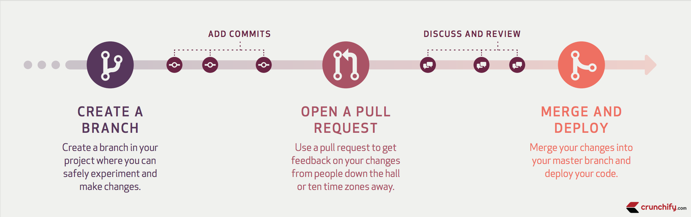

# Git flow: Manchester Codes Feb 22 Cohort
Repo for demonstrating git workflow

## Workflow


## Exercise

### 1. Clone this repo to your machine

### 2. Create a new branch to host your changes 
Create a branch with a sensible name that reflects what its content will be, then either create a new text file or pick one of the existing ones and make your changes.

Some useful commands:
```
git status
```
```
git switch -c <your-branch-name>
```
```
git branch
```

### 2. Commit your changes to your branch, and push up to the remote repo
Some useful commands:
```
git status
```
```
git add -p
```
```
git log --oneline
```
```
git branch
```

Your new branch should now appear in the browser.

### 3. Open a pull request to the `main` branch
You can request reviews from your peers here, and your changes are then reviewed. Comments and/or suggestions may be left for the author to action, or the PR accepted if no changes required.

### 4. Address feedback, if PR is accepted perform merge
Suggestions can be accepted in the browser or applied locally then pushed up to the same branch (if accepting changes in the browser remember these will need to be pulled down from the repo to your local environment).

If all changes are acceptable then the merge can be performed!

### 5. Fetch and pull down latest changes from repo
Now that there is new content in the remote repo that will not exist in your local `main` branch, it must be fetched. Switch to this branch (if not already on it) and run
```
git fetch origin/main
```
to see if any changes are present, then
```
git pull
```
to get them.
